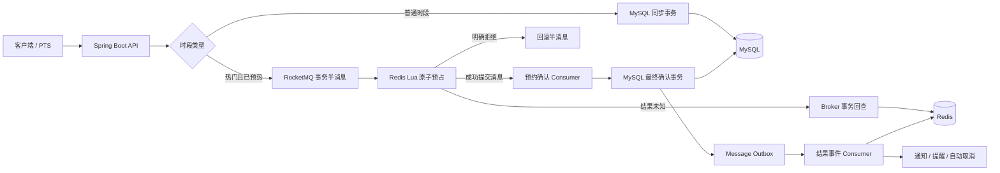
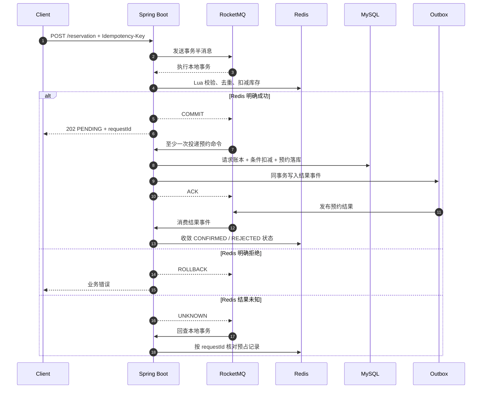

# 实验室资源预约平台（后端）

面向实验室公共设备与热门时段抢占场景的 Java 后端项目。系统同时保留普通预约的同步事务链路，并为热门时段实现 **RocketMQ 事务半消息 + Redis Lua 原子预占 + MySQL 异步确认 + Outbox 可靠事件**，重点解决高并发受理、一人一单、库存防超卖、重复投递和跨组件一致性问题。

## 版本入口

预约系统与 Agent/RAG 平台在同一个仓库中维护，通过分支提供两个版本：

| 分支 | 内容 |
| --- | --- |
| [`main`](https://github.com/Fragmentaim/lab-resource-reservation-platform/tree/main)（当前） | 用于求职展示的预约后端版本，聚焦 Java 业务与中间件设计 |
| [`feature/agent-hardening-v2`](https://github.com/Fragmentaim/lab-resource-reservation-platform/tree/feature/agent-hardening-v2) | 预约后端 + Spring AI Agent + FastAPI RAG，包含 `ai-service/`、工具调用、文档权限与完整平台编排 |

查看或运行 Agent 平台请进入对应分支，并使用该分支的环境模板、启动说明和 SQL。当前分支保留预约后端展示内容，压测账号和原始运行数据在本地隔离环境维护。

## 项目亮点

- **冷热链路分离**：普通时段使用 MySQL 同步事务；已预热热门时段走 Redis + RocketMQ 异步确认，避免所有请求争抢数据库连接。
- **事务消息缩小双写窗口**：先向 RocketMQ 发送半消息，再以 Redis Lua 作为本地事务；只有预占成功才提交消息，Redis 结果未知时由 Broker 回查。
- **单次 Lua 原子裁决**：在 Redis 内一次完成时段快照校验、开放状态校验、幂等校验、一人一单和库存扣减，不在请求线程等待或重建热点数据。
- **消费端最终一致**：`requestId` 请求账本抵御至少一次投递；MySQL 条件扣减与唯一约束作为最终防超卖、防重复保障。
- **Outbox 可靠发布结果**：预约落库与结果事件在同一数据库事务中提交，后续统一驱动 Redis 状态收敛、站内通知、预约提醒和自动取消。
- **可复现实验结论**：同一 ECS 与 PTS 环境下，500 并发抢 20 个名额，热门受理链路相较 SQL 基线 TPS 提升 57.2%，平均响应时间降低 48.9%。

## 系统架构



架构细节和异常窗口说明见 [docs/architecture.md](docs/architecture.md)。

## 热门预约执行链路



### 为什么是“先半消息，再执行 Lua”

如果先扣 Redis 再普通发送 MQ，会出现“Redis 已扣减，但应用在消息发送前宕机”的窗口，需要额外扫描和补偿。事务半消息把两个动作绑定为一个可回查流程：

1. 半消息发送失败：Lua 尚未执行，不产生库存变化。
2. Lua 明确成功：提交消息，交给 RocketMQ 可靠投递。
3. Lua 明确拒绝：回滚半消息，不进入消费端。
4. Lua 响应未知：不贸然提交或回滚，由 Broker 根据 Redis 中的 `requestId` 状态回查。

## 一致性设计

| 问题 | 处理方式 |
| --- | --- |
| 客户端重复点击 | `Idempotency-Key` 作为稳定 `requestId`，同一请求不重复扣库存 |
| 同一用户更换 requestId 重复抢同一时段 | Redis User Hash 实现一人一单；MySQL 唯一约束再次兜底 |
| Redis 并发扣减 | Lua 脚本原子执行校验、去重和扣减 |
| MQ 重复投递 | `reservation_request.request_id` 唯一账本幂等消费 |
| MySQL 超卖 | `remain_quota > 0` 条件更新，受影响行数为 0 即拒绝 |
| 数据库成功但结果消息未发出 | 业务结果与 Outbox 在同一事务提交，由调度器重试发布 |
| 消费端业务拒绝 | 写入 `REJECTED` 终态并 ACK；结果事件只释放一次 Redis 预占 |
| Redis 暂时不可用 | 热门预约快速失败，普通预约链路不受影响 |
| 热点缓存缺失 | 热门请求返回“系统准备中”，不降级为高并发直打 MySQL |

Redis 只保存热门时段的临时并发状态，MySQL 始终是最终业务事实来源。

## 性能测试

测试条件：同一台阿里云 ECS（4 vCPU / 8 GiB）、阿里云 PTS VPC 内网施压、500 并发、20 个库存、相同接口数据与服务器配置。

| 指标 | SQL 同步基线 | Redis + MQ 热门受理 | 改善 |
| --- | ---: | ---: | ---: |
| TPS | 170.59 | 268.24 | **+57.2%** |
| 平均响应时间 | 1.78 s | 0.91 s | **-48.9%** |
| P99 | 2.57 s | 1.50 s | **-41.7%** |

这里衡量的是**热门预约受理接口**的吞吐和响应时间。HTTP 202 表示请求已被可靠受理，最终预约结果由 MQ 消费端落库后通过 `GET /reservation/requests/{requestId}` 查询；不把受理成功等同于最终确认成功。

## 业务能力

- JWT 登录认证与管理员权限控制
- 资源、分类、时段、预约记录和字典管理
- 普通预约同步确认、热门预约异步确认
- 预约取消、签到、用户预约概览
- Redis 资源目录缓存、热点预热、Lua 预占与接口限流
- RocketMQ 事务消息、消费重试、死信处理
- Outbox 可靠事件、预约提醒和未签到自动取消
- 管理员关键操作审计

## 代码导航

```text
backend/src/main/java/com/fragment/labbooking
├─ reservation
│  ├─ api                 # 预约接口、DTO、VO
│  ├─ service             # 冷热路由、同步预约、异步确认、结果收敛
│  ├─ messaging           # 事务消息发布、事务监听器、MQ Consumer
│  ├─ redis               # 热点快照、Lua 预占、限流
│  ├─ persistence         # 预约与请求账本 Mapper
│  ├─ reminder            # 提醒与自动取消
│  └─ support             # 预约持久化与编号生成
├─ resource               # 资源与时段管理
├─ common/outbox          # Outbox 入队、发布与消费适配
├─ common/auth            # JWT 与登录上下文
└─ common/audit           # 管理员操作审计
```

建议阅读顺序：

1. [`ReservationController`](backend/src/main/java/com/fragment/labbooking/reservation/api/ReservationController.java)：接口入口。
2. [`ReservationCommandService`](backend/src/main/java/com/fragment/labbooking/reservation/service/ReservationCommandService.java)：普通/热门链路路由。
3. [`ReservationCommandPublisher`](backend/src/main/java/com/fragment/labbooking/reservation/messaging/ReservationCommandPublisher.java)：事务半消息发送。
4. [`ReservationTransactionListener`](backend/src/main/java/com/fragment/labbooking/reservation/messaging/ReservationTransactionListener.java)：Lua 本地事务和事务回查。
5. [`HotReservationRedisService`](backend/src/main/java/com/fragment/labbooking/reservation/redis/HotReservationRedisService.java)：热点快照与原子预占。
6. [`ReservationConfirmationService`](backend/src/main/java/com/fragment/labbooking/reservation/service/ReservationConfirmationService.java)：MySQL 最终确认事务。
7. [`ReservationResultService`](backend/src/main/java/com/fragment/labbooking/reservation/service/ReservationResultService.java)：Redis、通知和提醒状态收敛。

## 快速启动

环境要求：Docker Compose，或本机 Java 17 + MySQL 8 + Redis 7 + RocketMQ 4.9。

```powershell
Copy-Item .env.example .env
docker compose --env-file .env up -d --build
```

启动后：

- 后端地址：`http://localhost:8081`
- 健康检查：`GET http://localhost:8081/system/health`
- 初始化 SQL：`backend/src/main/resources/sql/lab-booking-rebuild-init.sql`

`.env.example` 仅包含示例值；正式部署前请替换数据库密码和 `JWT_SECRET`。

## 本地测试

```powershell
cd backend
mvn test
```

GitHub Actions 会执行 Java 测试、Compose 配置校验和敏感信息扫描。

## 技术栈

Java 17、Spring Boot 4、MyBatis-Plus、MySQL 8、Redis、Redisson、RocketMQ、Spring Cloud Stream、JWT、Maven、Docker Compose
