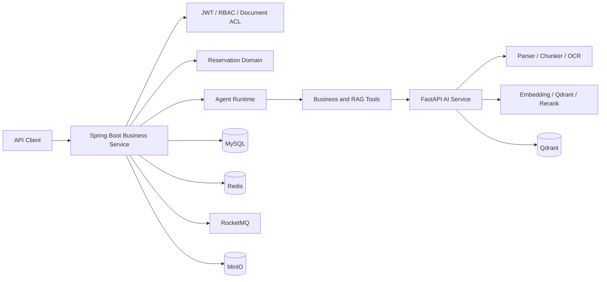

# 实验室智能预约与知识库 Agent 平台（后端）

面向实验室资源预约、制度问答和业务查询场景的后端项目。仓库由 **Spring Boot 业务服务**与 **FastAPI AI 服务**组成，不包含前端；重点展示预约一致性、可靠异步链路、原生 LLM Function Calling、RAG 权限控制、上下文管理和可观测性。

## 系统架构



Java 服务负责身份、权限、预约业务、文档元数据、工具执行与审计；Python 服务负责文档解析、切片、向量检索、重排、上下文摘要和模型调用。业务权限始终由 Java 侧校验，模型不能绕过服务层直接访问数据库。

## 核心设计

### 1. 预约与可靠异步链路

- 通过数据库事务、名额条件更新与唯一约束保证同一用户、资源和时段不会重复预约。
- 热门时段支持 Redis 预占、请求单受理和 RocketMQ 异步确认；消费端在事务内完成预约落库与状态流转。
- 使用 Outbox 记录待投递事件，避免“数据库提交成功但消息未发送”的双写不一致。
- 预约提醒、未签到自动取消和请求超时使用 RocketMQ 延迟消息；消费者按事件 ID 和业务终态实现幂等，并保留重试、死信和扫描兜底能力。
- Redis 用于热点资源缓存、限流和重复提交控制；MySQL 保存最终业务事实。

### 2. 原生 Function Calling Agent

RAG 不是固定前置步骤，而是 Agent 可按需调用的工具。当前工具包括：

| 工具 | 作用 | 安全边界 |
| --- | --- | --- |
| `reservation_context` | 查询当前用户的预约摘要 | 默认只能读取本人数据 |
| `resource_availability` | 查询资源和未来可预约时段 | 只读、限制返回字段和数量 |
| `reservation_cancellation_preview` | 预检预约是否可取消 | 不直接执行取消写操作 |
| `knowledge_search` | 在有权限的文档范围内召回候选片段 | 返回候选定位信息 |
| `knowledge_open_chunks` | 打开已召回候选的完整正文 | 只能读取本轮候选 chunk |

模型通过 OpenAI-compatible `tools/tool_calls` 协议选择工具；Java 运行时负责工具白名单、参数校验、权限检查、调用执行和结果回传。知识库回答采用“先检索候选、再打开证据”的两阶段读取，减少无关文本进入上下文并保留引用来源。

### 3. 会话上下文与可观测性

- 根据模型能力配置动态计算上下文预算，组织系统提示、最近对话、Working Memory、工具结果和证据。
- 当历史内容逼近窗口时，由模型生成结构化会话摘要；旧摘要与新增对话继续合并，避免只依赖固定轮数截断。
- 大型工具结果保留摘要和结果标识，需要细节时再按需打开，降低上下文噪声。
- `Agent Run / Step` 记录路由、工具调用、检索、模型执行、耗时、token 使用和异常，支持按 `traceId` 回溯完整链路。

### 4. 多格式知识入库与文档 ACL

- 支持 PDF、Word、Excel、Markdown、纯文本和图片入库，保留页码、标题路径、表格位置和 chunk 标识等元数据。
- PDF 按页执行 Native / Hybrid / OCR 路由：文本页直接解析，图文混排页仅 OCR 图片区域，扫描页执行整页 OCR。
- PaddleOCR 按需加载，可配置 GPU/CPU；解析结果记录路由、字符数、图片数、置信度和警告信息。
- 文档访问范围支持公开、管理员、上传者和指定用户；向量检索前先计算可访问文档集合并下推过滤条件。
- 文档上传、解析、切片和索引构建通过 RocketMQ + Outbox 异步执行，失败任务保留重试次数与处理轨迹。

## 技术栈

- Java 17、Spring Boot 4、MyBatis-Plus、MySQL、Redis、RocketMQ、JWT
- Python 3.11+、FastAPI、Qdrant、PaddleOCR、Sentence Transformers
- MinIO、Maven、Docker、Git

## 仓库结构

```text
.
├─ backend/                 Spring Boot 业务服务与 Agent 运行时
├─ ai-service/              FastAPI 文档解析、检索和模型服务
├─ sql/                     初始化与增量升级脚本
├─ scripts/                 启动、模型验收和 RAG 评测脚本
└─ docs/                    架构、数据模型和 RAG 评测说明
```

## 快速启动

### 1. Docker Compose（推荐）

仓库提供 MySQL、Redis、RocketMQ 4.9、MinIO、Qdrant、Spring Boot 与 FastAPI 的本地运行编排。复制环境变量模板后启动：

```bash
cp .env.example .env
docker compose up --build
```

首次启动会初始化演示数据库。默认端口为：后端 `8081`、AI 服务 `8000`、MinIO Console `9001`、Qdrant `6333`；可在根目录 `.env` 覆盖。后端健康检查为 `GET /system/health`，AI 服务健康检查为 `GET /api/v1/ai/health`。

`.env.example` 中是仅供本地演示的默认值，部署前必须替换数据库密码、MinIO 密码和 JWT 密钥。LLM/Embedding 可填写任意 OpenAI-compatible 服务；未配置模型时，文档及基础设施服务仍可启动，但模型相关接口会处于降级状态。

### 2. 手动启动基础设施

准备 MySQL 8、Redis、RocketMQ 4.9.x、MinIO 和 Qdrant。首次初始化时按顺序执行：

```sql
source backend/src/main/resources/sql/lab-booking-rebuild-init.sql;
source backend/src/main/resources/sql/knowledge-rag-module-init.sql;
```

如从旧版本升级，请按 `sql/` 中升级脚本的日期和说明依次执行。

### 3. 启动 Java 服务

```bash
cd backend
mvn spring-boot:run -Dspring-boot.run.profiles=mq
```

常用环境变量：

| 变量 | 示例 |
| --- | --- |
| `MYSQL_URL` | `jdbc:mysql://127.0.0.1:3306/lab_booking?...` |
| `MYSQL_USERNAME` / `MYSQL_PASSWORD` | 数据库账号 |
| `REDIS_HOST` / `REDIS_PORT` | Redis 地址 |
| `ROCKETMQ_NAMESERVER` | `127.0.0.1:9876` |
| `JWT_SECRET` | 至少 32 字节的随机字符串 |
| `AI_SERVICE_BASE_URL` | `http://127.0.0.1:8000` |
| `MINIO_ENDPOINT` / `MINIO_ACCESS_KEY` / `MINIO_SECRET_KEY` | MinIO 配置 |

Java API 默认监听 `http://127.0.0.1:8081`。

### 4. 启动 AI 服务

```bash
cd ai-service
python -m venv .venv
# Windows: .venv\Scripts\activate
# Linux/macOS: source .venv/bin/activate
pip install -r requirements.txt
# 可选：在支持 CUDA 的 OCR 工作节点安装 GPU OCR 依赖
# pip install -r requirements-ocr-gpu.txt
cp .env.example .env
uvicorn app.main:app --host 0.0.0.0 --port 8000
```

在 `.env` 中配置 OpenAI-compatible 模型接口、Embedding、Rerank、Qdrant 和 OCR。密钥及本地模型目录不会提交到仓库。

## 测试

```bash
cd backend
mvn test

cd ../ai-service
python -m pip install -r requirements-dev.txt
python -m pytest -q
```

当前 Java 测试集覆盖预约状态、权限边界、工具调用、上下文规划、文档 ACL、异步任务和异常路径；AI 测试覆盖解析路由、上下文裁剪、重排回退、混合检索融合与 ACL 检索门槛。以 CI 实际结果为准，不在 README 固化会过期的性能或测试数量。

每次推送和 PR 会由 GitHub Actions 运行 Java 测试、Python 编译检查、Docker Compose 配置校验和敏感信息扫描。实际容器联调依赖 Docker Daemon 与外部模型配置，因此只在本地或部署环境完成。

### MCP Sidecar

项目提供基于官方 Python MCP SDK 的独立 MCP Sidecar，暴露“我的预约上下文、资源可用性、取消预检、知识库问答”四个能力。它只转发 Java 后端已有的鉴权接口，JWT 由 MCP 进程环境中的 `MCP_ACCESS_TOKEN` 持有，不会作为模型可见的 Tool 参数传递；预约写操作不在 MCP 中暴露。

本地 IDE 使用 stdio：

```bash
cd ai-service
set MCP_ACCESS_TOKEN=your-jwt
python -m app.mcp_server
```

需要 Streamable HTTP 时以单用户 Sidecar 方式启动：

```bash
docker compose --profile mcp up mcp
```

不要让多个用户共享同一个 `MCP_ACCESS_TOKEN`；多租户 HTTP 部署需要接入 OAuth/资源服务器后再开放。

### Agent 恢复点

Agent Run 在规划和每次工具执行状态变化后写入短时 checkpoint（默认 15 分钟）。checkpoint 只保存阶段、轮次、已完成工具和检索候选引用，不保存用户问题、模型回答、工具正文或文档内容。`POST /knowledge/qa/resume/{traceId}` 仅允许原用户恢复仍为 `PENDING` 的运行，并会重新执行当前 ACL、会话规划与工具校验；成功、失败或过期时 checkpoint 会被清理。

这不是对模型输出的盲目重放，也不恢复任何预约写操作。

## 代码导航

- Agent 工具编排：`backend/src/main/java/com/fragment/labbooking/knowledge/agent/tool/`、`backend/src/main/java/com/fragment/labbooking/knowledge/service/impl/NativeToolCallingServiceImpl.java`
- Agent 运行轨迹：`backend/src/main/java/com/fragment/labbooking/knowledge/service/impl/AgentRunServiceImpl.java`
- 会话上下文：`backend/src/main/java/com/fragment/labbooking/knowledge/agent/`
- 文档权限与知识库：`backend/src/main/java/com/fragment/labbooking/knowledge/`
- 文档解析与 OCR：`ai-service/app/core/parser.py`、`ai-service/app/core/ocr_engine.py`
- 检索与切片：`ai-service/app/core/chunker.py`、`ai-service/app/core/rag_pipeline.py`、`ai-service/app/core/reranker.py`
- 检索质量门槛：`ai-service/app/core/retrieval_eval.py`、`ai-service/evals/`
- 数据库脚本：`sql/`

## 安全说明

- 示例配置仅用于本地开发；生产环境必须通过环境变量或密钥管理服务注入凭据。
- 不要提交 `.env`、模型缓存、上传文件、向量库数据、日志或构建产物。
- Agent 中会产生副作用的业务操作应保留人工确认；当前取消工具仅返回预检结果。
