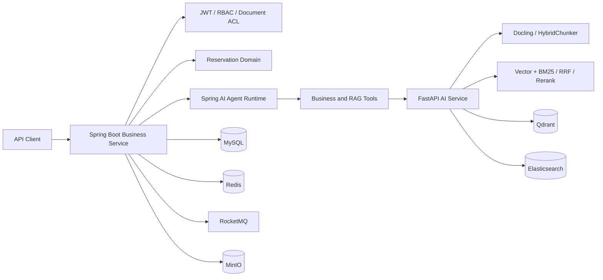

# 实验室智能预约与知识库 Agent 平台（后端）

面向实验室资源预约、制度问答和业务查询场景的后端项目。仓库由 **Spring Boot + Spring AI Agent 服务**与 **FastAPI RAG 服务**组成，不包含前端；重点展示预约一致性、可靠异步链路、原生 LLM Function Calling、RAG 权限控制、上下文管理和可观测性。

## 版本入口

预约系统与 Agent/RAG 平台在同一个 GitHub 仓库中维护，通过分支提供两个版本：

| 分支 | 内容 | 适用场景 |
| --- | --- | --- |
| [`main`](https://github.com/Fragmentaim/lab-resource-reservation-platform/tree/main) | 预约后端展示版本 | 查看预约一致性、事务消息与 Outbox 设计 |
| [`feature/agent-hardening-v2`](https://github.com/Fragmentaim/lab-resource-reservation-platform/tree/feature/agent-hardening-v2)（当前） | 预约后端 + Spring AI Agent + FastAPI RAG | 开发和运行完整智能预约与知识库后端 |

两个分支的服务、配置和数据库脚本不同。启动完整平台时请检出当前分支，并使用当前分支的 `.env.example`、`compose.yaml` 与 SQL 脚本。目录与文档入口见 [文档索引](docs/README.md)，日常启动及评测入口见 [脚本说明](scripts/README.md)。

## 系统架构



Java 服务负责身份、权限、预约业务、文档元数据、Spring AI 工具编排与审计；Python 服务负责文档解析、切片、向量检索、重排和会话摘要。业务权限始终由 Java 侧校验，模型不能绕过服务层直接访问数据库。

## 核心设计

### 1. 预约与可靠异步链路

- 通过数据库事务、名额条件更新与唯一约束保证同一用户、资源和时段不会重复预约。
- 热门时段在开放前由 MySQL 预热 Redis 快照；请求先发送 RocketMQ 半消息，再由事务监听器通过单个 Lua 脚本原子完成时段校验、用户去重、库存扣减和短期请求状态写入，成功后提交消息，失败则回滚半消息。
- RocketMQ 提供事务回查与至少一次投递；消费端以 `requestId` 幂等地写入精简请求账本，在事务内条件扣减 MySQL 名额并完成预约落库。
- 使用 Outbox 记录待投递事件，避免“数据库提交成功但消息未发送”的双写不一致。
- 预约结果通过 Outbox 发布，驱动 Redis 状态收敛、站内通知、预约提醒和未签到自动取消；不再维护 Redis Pending ZSet 和应用层定时重发器。
- `POST /reservation` 使用 UUID `Idempotency-Key`：普通时段同步返回 `CONFIRMED`，热门时段返回 HTTP 202 `PENDING`；`GET /reservation/requests/{requestId}` 查询本人最终结果。
- Redis 仅缓存首页资源目录，并承担热门时段原子预占、限流和重复提交控制；资源详情与普通时段实时读取 MySQL，MySQL 保存最终业务事实。

### 2. 原生 Function Calling Agent

RAG 不是固定前置步骤，而是 Agent 可按需调用的工具。当前工具包括：

| 工具 | 作用 | 安全边界 |
| --- | --- | --- |
| `reservation_context` | 查询当前用户的预约摘要 | 默认只能读取本人数据 |
| `resource_availability` | 查询资源和未来可预约时段 | 只读、限制返回字段和数量 |
| `reservation_create_draft` | 基于确定的资源与时段生成预约草案 | 不扣减库存、不落库，必须等待界面显式确认 |
| `reservation_cancellation_preview` | 预检预约是否可取消 | 不直接执行取消写操作 |
| `knowledge_search` | 在有权限的文档范围内召回候选片段 | 返回候选定位信息 |
| `knowledge_open_chunks` | 打开已召回候选的完整正文 | 只能读取本轮候选 chunk |

Spring AI 负责模型调用、`tools/tool_calls` 解析和多轮工具循环；Java 业务工具继续负责参数校验、权限检查、执行、审计和结果裁剪。知识库回答采用“先检索候选、再打开证据”的两阶段读取，减少无关文本进入上下文并保留引用来源。

预约写操作采用两阶段确认：Agent 只能用 `reservation_create_draft` 生成一个绑定当前用户、默认 10 分钟有效的确认令牌；前端展示资源、时段与余量后，用户点击确认并调用 `POST /knowledge/tools/reservation-drafts/{confirmationToken}/confirm`（请求体为 `{"confirmed": true}`）。确认接口会校验令牌归属，并从确认令牌派生稳定 UUID，重复确认始终复用同一个 `requestId`；最终由 `ReservationCommandService`、Redis 预占和 MQ 异步确认链路裁决。

### 3. 会话上下文与可观测性

- 根据模型能力配置动态计算上下文预算，组织系统提示、最近原始对话、可扩展 Markdown 会话交接、工具结果和证据；窗口不足时由 LLM 同步理解并重写完整交接记录。
- 当历史内容逼近窗口时，由模型同步重写会话交接；旧交接与新增对话继续合并，避免只依赖固定轮数截断。
- 大型工具结果保留摘要和结果标识，需要细节时再按需打开，降低上下文噪声。
- `Agent Run / Step` 记录路由、工具调用、检索、模型执行、耗时、token 使用和异常，支持按 `traceId` 回溯完整链路。

### 4. 多格式知识入库与文档 ACL

- 支持 PDF、Word、Excel、Markdown、纯文本和图片入库，保留页码、标题路径、表格位置和 chunk 标识等元数据。
- 文档解析统一采用 Docling，覆盖 PDF、Word、Excel、Markdown、纯文本和图片；同一结构化文档模型中保留标题层级、页码、表格、公式、图片及来源位置。
- PDF 与图片由 Docling 完成版面分析、OCR、表格结构恢复、公式增强和图片分类；可选接入本地 VLM 或 OpenAI-compatible 多模态 API。流程图由 Python 侧生成“摘要、节点、连线条件和不确定项”结构化 Markdown，与页码和标题一起进入检索索引；Java 侧只负责任务编排、版本切换和 chunk 审计副本，不重复解析图结构。
- 使用 Docling `HybridChunker` 按模型 Token 上限进行结构感知切片，保留标题上下文、表头和 DocItem 来源引用，避免自研字符切片破坏表格与章节语义。
- 文档访问范围支持公开、管理员、上传者和指定用户；向量检索前先计算可访问文档集合并下推过滤条件。
- 检索采用 Qdrant 向量召回与 Elasticsearch BM25 双路召回，将文档 ACL 过滤同时下推到两条检索链路；候选结果经加权 RRF 融合后统一 Rerank，最终只向 Agent 返回配置的 TopK 证据。
- 文档上传、解析、切片和索引构建通过 RocketMQ + Outbox 异步执行，失败任务保留重试次数与处理轨迹。

## 技术栈

- Java 17、Spring Boot 4、Spring AI 2、MyBatis-Plus、MySQL、Redis、RocketMQ、JWT
- Python 3.11+、FastAPI、Docling、Qdrant、Elasticsearch、Sentence Transformers
- MinIO、Maven、Docker、Git

## 仓库结构

```text
.
├─ backend/                 Spring Boot 业务服务与 Agent 运行时
├─ ai-service/              FastAPI 文档解析、检索和模型服务
├─ sql/                     初始化与增量升级脚本
├─ scripts/                 启动、模型验收和 RAG 评测脚本
├─ docs/                    数据模型和 Agent/RAG 评测说明
├─ docker/                  容器基础设施配置
├─ compose.yaml             完整平台的本地服务编排
└─ .github/workflows/       自动检查
```

## 快速启动

### 1. Docker Compose（推荐）

仓库提供 MySQL、Redis、RocketMQ 4.9、MinIO、Qdrant、Elasticsearch、Spring Boot 与 FastAPI 的本地运行编排。复制环境变量模板后启动：

```bash
cp .env.example .env
docker compose up --build
```

首次启动会初始化演示数据库。默认端口为：后端 `8081`、AI 服务 `8000`、MinIO Console `9001`、Qdrant `6333`、Elasticsearch `9200`；可在根目录 `.env` 覆盖。后端健康检查为 `GET /system/health`，AI 服务健康检查为 `GET /api/v1/ai/health`。

`.env.example` 中是仅供本地演示的默认值，部署前必须替换数据库密码、MinIO 密码和 JWT 密钥。`AGENT_LLM_*` 配置 Spring AI 使用的 OpenAI-compatible 模型，Embedding/Rerank 仍由 FastAPI 配置；未配置模型时，文档及基础设施服务仍可启动，但模型相关接口不可用。

### 2. 手动启动基础设施

准备 MySQL 8、Redis、RocketMQ 4.9.x、MinIO、Qdrant 和 Elasticsearch 8.19.x。首次初始化时按顺序执行：

```sql
source backend/src/main/resources/sql/lab-booking-rebuild-init.sql;
source backend/src/main/resources/sql/knowledge-rag-module-init.sql;
```

如从旧版本升级，请按 `sql/` 中升级脚本的日期和说明依次执行。

### 3. 启动 Java 服务

```bash
cd backend
mvn spring-boot:run -Dspring-boot.run.profiles=mq
```

常用环境变量：

| 变量 | 示例 |
| --- | --- |
| `MYSQL_URL` | `jdbc:mysql://127.0.0.1:3306/lab_booking?...` |
| `MYSQL_USERNAME` / `MYSQL_PASSWORD` | 数据库账号 |
| `REDIS_HOST` / `REDIS_PORT` | Redis 地址 |
| `ROCKETMQ_NAMESERVER` | `127.0.0.1:9876` |
| `JWT_SECRET` | 至少 32 字节的随机字符串 |
| `AI_SERVICE_BASE_URL` | `http://127.0.0.1:8000` |
| `MINIO_ENDPOINT` / `MINIO_ACCESS_KEY` / `MINIO_SECRET_KEY` | MinIO 配置 |

Java API 默认监听 `http://127.0.0.1:8081`。

### 4. 启动 AI 服务

```bash
cd ai-service
python -m venv .venv
# Windows: .venv\Scripts\activate
# Linux/macOS: source .venv/bin/activate
pip install -r requirements.txt
# 可选：在支持 CUDA 的文档处理节点恢复 GPU PyTorch 运行时
# pip install -r requirements-docling-gpu.txt
cp .env.example .env
uvicorn app.main:app --host 0.0.0.0 --port 8000
```

在 `.env` 中配置 OpenAI-compatible 模型接口、Embedding、Rerank、Qdrant、Elasticsearch 和 Docling。图片描述支持关闭、本地 VLM 或 OpenAI-compatible 多模态 API 三种模式；密钥及本地模型目录不会提交到仓库。

关键词检索默认使用 Elasticsearch 内置 `cjk` analyzer，无须安装插件即可运行。若部署环境已安装与 Elasticsearch **完全同版本**的 IK Analysis 插件，可将 `ELASTICSEARCH_INDEX_ANALYZER` / `ELASTICSEARCH_SEARCH_ANALYZER` 分别改为 `ik_max_word` / `ik_smart`；分析器变更后需要重建索引。

从只使用 Qdrant 的旧环境升级时，先启动 Qdrant 与 Elasticsearch，再执行一次回填：

```bash
cd ai-service
python -m app.cli.rebuild_elasticsearch
```

该命令流式读取 Qdrant 中已有的 chunk payload，以稳定 `chunkId` 写入 Elasticsearch，不需要重新上传原始文档。新文档入库和文档删除会同时维护 Qdrant 与 Elasticsearch；任一索引写入失败时，本次异步文档任务保持失败状态并进入原有重试流程。项目不再保留进程内 BM25 旁路，避免多实例索引不一致和全量扫描 Qdrant。

## 测试

```bash
cd backend
mvn test

cd ../ai-service
python -m pip install -r requirements-dev.txt
python -m pytest -q
```

当前 Java 测试集覆盖预约状态、权限边界、工具调用、上下文规划、文档 ACL、异步任务和异常路径；AI 测试覆盖 Docling 结构映射、上下文裁剪、重排回退、混合检索融合与 ACL 检索门槛。以 CI 实际结果为准，不在 README 固化会过期的性能或测试数量。

向 `main`、`agent/**` 或当前 Agent 分支推送，以及面向 `main` 的 PR，会由 GitHub Actions 运行 Java 测试、Python 编译和测试、Docker Compose 配置校验和敏感信息扫描。实际容器联调依赖 Docker Daemon 与外部模型配置，因此只在本地或部署环境完成。

### MCP Sidecar

项目提供基于官方 Python MCP SDK 的独立 MCP Sidecar，暴露“我的预约上下文、资源可用性、取消预检、知识库问答”四个能力。它只转发 Java 后端已有的鉴权接口，JWT 由 MCP 进程环境中的 `MCP_ACCESS_TOKEN` 持有，不会作为模型可见的 Tool 参数传递；预约写操作不在 MCP 中暴露。

本地 IDE 使用 stdio：

```bash
cd ai-service
set MCP_ACCESS_TOKEN=your-jwt
python -m app.mcp_server
```

需要 Streamable HTTP 时以单用户 Sidecar 方式启动：

```bash
docker compose --profile mcp up mcp
```

不要让多个用户共享同一个 `MCP_ACCESS_TOKEN`；多租户 HTTP 部署需要接入 OAuth/资源服务器后再开放。

## 代码导航

- 预约业务：`backend/src/main/java/com/fragment/labbooking/reservation/`，按 API、消息、模型、持久化、Redis、提醒与服务划分
- Agent 模型入口：`backend/src/main/java/com/fragment/labbooking/knowledge/service/impl/SpringAiAgentService.java`
- Agent 工具定义与执行：`backend/src/main/java/com/fragment/labbooking/knowledge/agent/tool/`
- Agent 运行轨迹：`backend/src/main/java/com/fragment/labbooking/knowledge/service/impl/AgentRunServiceImpl.java`
- 会话上下文：`backend/src/main/java/com/fragment/labbooking/knowledge/service/impl/QaSessionManager.java`
- 文档权限与知识库：`backend/src/main/java/com/fragment/labbooking/knowledge/`
- 文档解析与切片：`ai-service/app/core/docling_pipeline.py`
- 混合检索：`ai-service/app/core/rag_pipeline.py`、`ai-service/app/core/elasticsearch_store.py`、`ai-service/app/core/vectorstore.py`、`ai-service/app/core/reranker.py`
- 检索质量门槛：`ai-service/app/core/retrieval_eval.py`、`ai-service/evals/`
- 数据库脚本：`sql/`

## 安全说明

- 示例配置仅用于本地开发；生产环境必须通过环境变量或密钥管理服务注入凭据。
- 不要提交 `.env`、模型缓存、上传文件、向量库数据、日志或构建产物。
- Agent 中会产生副作用的业务操作应保留人工确认；当前取消工具仅返回预检结果。
