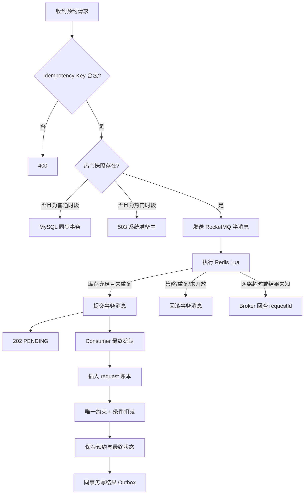
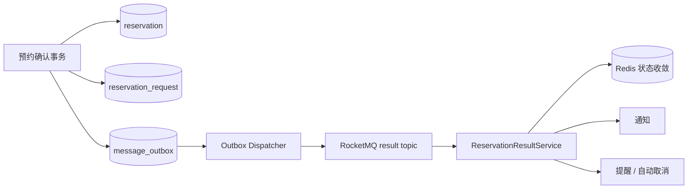

# 热门预约架构说明

## 1. 冷热路由

| 场景 | 执行方式 | 返回语义 |
| --- | --- | --- |
| 普通时段 | MySQL 本地事务同步创建预约 | HTTP 200，`CONFIRMED` |
| 已预热热门时段 | RocketMQ 事务半消息 + Redis Lua 预占 + MQ 异步确认 | HTTP 202，`PENDING` |
| 热门时段未预热 | 拒绝请求，不降级直打数据库 | HTTP 503 |
| Redis 不可用 | 热门链路快速失败；普通链路继续工作 | HTTP 503 / 200 |

请求入口保持统一：`POST /reservation`。服务端根据时段类型和热门快照选择执行链路，前端不需要维护两个业务接口。

## 2. Redis 数据结构

```text
reservation:hot:v2:snapshot:{slotId}   Hash   # 资源、时段、开放状态和结束时间快照
reservation:hot:v2:stock:{slotId}      String # 当前可预占库存
reservation:hot:v2:users:{slotId}      Hash   # userId -> requestId，一人一单
reservation:request:v2:{requestId}     Hash   # 请求参数与 PRE_RESERVED/终态
```

请求线程只读取已经准备好的热点状态，不负责等待、加锁或重建。热门时段由启动恢复和管理员配置变更触发预热。

## 3. 一次热门预约



## 4. 消费端幂等

RocketMQ 提供至少一次投递，因此“消息可能重复”是正常情况。消费端使用两层约束：

1. `reservation_request.request_id` 唯一索引：同一个客户端请求只处理一次。
2. 预约活跃唯一约束：即使用户更换 requestId，同一用户也不能重复占用同一时段。

重复消息发现请求账本已经是 `CONFIRMED / REJECTED / EXPIRED` 时直接 ACK；技术异常抛出，让 Binder 和 RocketMQ 重试。

## 5. 数据库最终确认事务

同一个 MySQL 本地事务完成：

1. 插入 `PROCESSING` 请求账本。
2. 重新校验资源、时段和开放状态。
3. 插入预约记录并依靠唯一约束防重。
4. 使用 `remain_quota > 0` 条件更新扣减库存。
5. 将请求账本更新为 `CONFIRMED` 或 `REJECTED`。
6. 写入唯一结果 Outbox。

只要事务回滚，预约、库存、请求终态和结果事件会一起回滚。

## 6. Outbox 的职责

Outbox 不参与入口削峰，它解决的是数据库与后续消息的可靠双写：



如果进程在数据库提交后、消息发送前宕机，Outbox 记录仍在；服务恢复后继续发布，不会出现“预约成功但后续事件永久丢失”。

## 7. 故障窗口

| 故障点 | 系统行为 |
| --- | --- |
| 半消息未到 Broker | 请求失败，Redis 尚未扣减 |
| 半消息到达但 Lua 明确拒绝 | 回滚半消息，返回业务错误 |
| Lua 已执行但响应未知 | 返回 UNKNOWN，Broker 回查 Redis 请求记录 |
| Consumer 连接 MySQL 失败 | 不 ACK，由 RocketMQ 重试 |
| Consumer 提交成功但 ACK 丢失 | 消息重复投递，请求账本幂等返回 |
| MySQL 业务状态变化导致拒绝 | 写 REJECTED + 结果 Outbox，结果消费时只释放一次 Redis 占位 |
| Outbox 发布失败 | 保留待发送状态，调度器后续重试 |
| 结果事件重复 | eventId/业务唯一键保证通知、提醒和库存收敛幂等 |

设计原则是：明确的业务拒绝落终态并 ACK；可恢复的技术异常交给 MQ 重试；未知状态不凭猜测修改库存。

