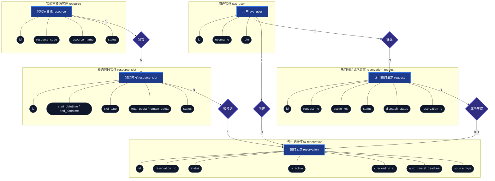
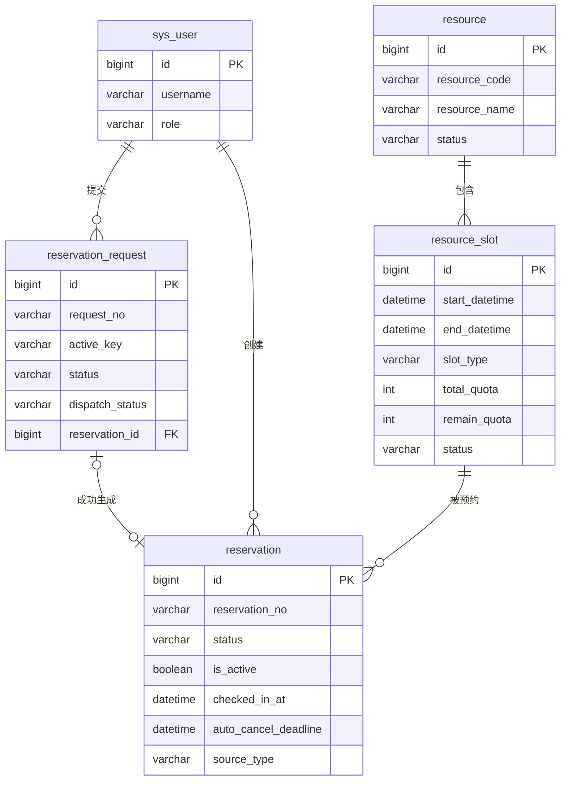
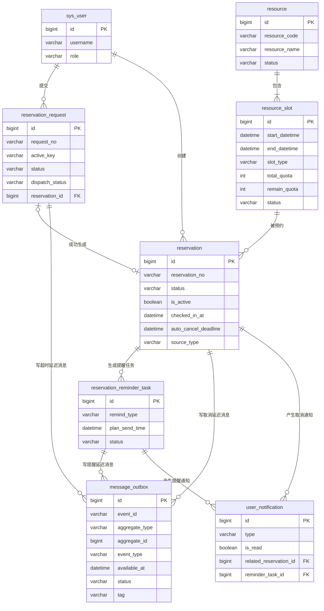

# 预约链路 E-R 图

本页面包含预约链路的 E-R 图设计。为了解决陈氏（Chen's Style）E-R 图由于属性节点过多导致图片拥挤、排版混乱且难以看清的问题，我们进行了以下优化：

1. **核心链路独立成图**：排除了提醒任务、可靠消息 Outbox、通知等辅助表，只保留最核心的 5 张预约核心表。
2. **属性分组盒化（Subgraph）**：将实体的属性用虚线框（子图）包裹，让属性保持在实体节点附近，防止属性泡泡满屏乱飞导致画面拥挤。
3. **现代 Crow's Foot 关系图**：提供了现代化的数据库关系图，将属性收纳在实体内部，彻底消除拥挤感，适合在技术设计中使用。
4. **交互式高清查看器**：在 `docs/view-er.html` 中提供了一个交互式网页，支持**无限缩放、鼠标拖拽平移、以及导出高清大图（超清分辨率，无损放大不模糊）**。

> [!TIP]
> **如何查看无挤压的高清大图？**
>
> 1. 打开项目中的 [view-er.html](file:///D:/_Projects/01_Java/lab-booking-course/docs/view-er.html) 文件（可直接拖进任何浏览器，或在 VS Code 里右键 Open In Browser）。
> 2. 在查看器中，你可以通过**鼠标滚轮**无限缩放图表，用**鼠标拖拽**平移画布，非常宽敞、毫不挤压。
> 3. 点击 **“导出超清 PNG 图片”**，可以生成一张分辨率超大的无损 PNG 图片，可以直接插入到你的 PPT 汇报或文档中！

---

## 1. 核心预约链路 E-R 图（陈氏风格 - 分组优化版）

*说明：矩形表示实体，椭圆表示属性，菱形表示关系。*

---

## 2. 核心预约链路 E-R 图（现代 Crow's Foot 风格）

*说明：现代 ER 图风格，属性直接收纳在实体内部，连线表示外键对应关系。这种风格极其精炼，适合直接映射到物理表结构，而且完全没有拥挤感。*

---

## 3. 全量预约系统关系图（包含提醒、Outbox 消息、通知）

*说明：展示系统全量实体关系（含异步通知与可靠性消息机制）。*

---

## 关系与约束说明

### 核心关系说明

| 关系 | 说明 |
| --- | --- |
| 用户提交热门预约请求 | 热门资源走异步确认，先写 `reservation_request`，状态为 `PENDING` |
| 用户创建预约 | 普通预约同步生成 `reservation`；热门预约消费成功后生成 `reservation` |
| 资源包含时段 | 一个实验室资源可以有多个可预约时段 |
| 时段被预约 | 一个时段可以被多个用户预约，但受 `remain_quota` 控制 |
| 请求成功生成预约 | 热门请求从 `PENDING -> PROCESSING -> SUCCESS` 后关联预约 ID |

### 关键物理/逻辑约束

| 约束名 | 作用表与字段 | 作用与业务逻辑说明 |
| --- | --- | --- |
| `uk_reservation_user_slot_active` | `reservation(user_id, slot_id, is_active)` | 防止同一个用户对同一个时段存在多个有效预约 |
| `uk_reservation_request_active_key` | `reservation_request(active_key)` | 防止同一个用户对同一个时段存在多个未完成的热门预约请求 |
| `uk_reservation_reminder_reservation_type` | `reservation_reminder_task(reservation_id, remind_type)` | 防止同一个预约记录重复生成同类型的提醒任务 |
| `uk_message_outbox_event_id` | `message_outbox(event_id)` | 防止同一业务事件重复写入消息 Outbox 造成重复消费 |
| `uk_user_notification_reminder_task` | `user_notification(reminder_task_id)` | 防止同一个提醒任务重复生成用户通知 |
